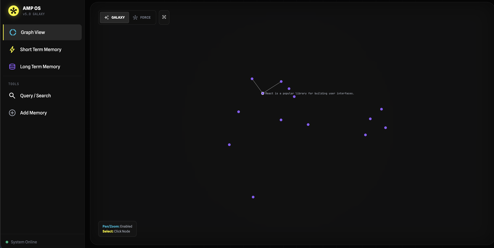
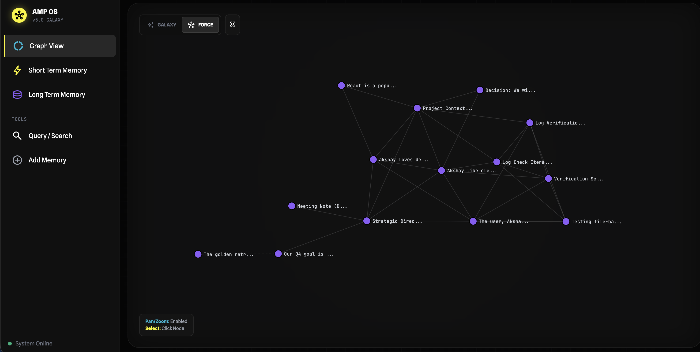
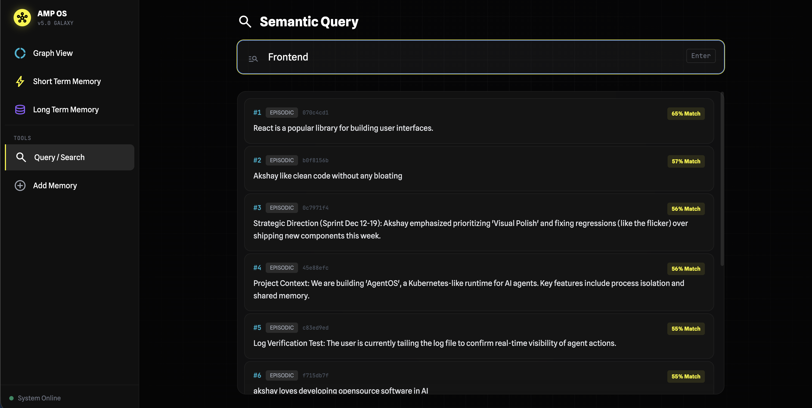

# AMP: The Agent Memory Protocol 🧠

**The Open Standard for Agentic Memory.**

[](https://opensource.org/licenses/MIT)
[](https://www.python.org/downloads/)
[](https://modelcontextprotocol.io/introduction)
[](https://pypi.org/project/amp-memory/)

---

## The (Short) Story

I was tired of building AI agents that **forgot everything** the moment I closed the terminal. 

RAG (Retrieval Augmented Generation) is great for documents, but terrible for *experience*. It chunks text blindly, losing the narrative. When I asked my agents "Why did we decide this yesterday?", they gave me hallucinated nonsense.

So I built **AMP**. It's not just a database; it's a **Hippocampus** for your agents. It mimics the human brain's distinction between **Working Memory** (Short-term context) and **episodic Long-Term Memory**, giving your agents a continuous, evolving sense of self.

## Why developers are switching to AMP?

### 🌌 Galaxy View (Visualization)
Don't just *guess* what your agent knows. **See it.**
AMP comes with a local dashboard. Watch memories form constellations in real-time. Nodes cluster by semantic meaning—if two ideas are related, they physically move together.



---

### 🕸️ Force Mode (Physics)
Toggle to **Force Mode** to see the topological connections between your memories. It uses a physics simulation (D3.js) to show you how different memory clusters are "pulled" together by shared context.



---

### 🔍 Semantic Query
Stop guessing keywords. Query your agent's memory using natural language. I built a dedicated interface that not only finds relevant memories but shows you the **Relevance Score** (0-100%) so you know exactly why a memory was retrieved.



---

### 🔌 MCP Native (Plug & Play)
Built from day one for the **Model Context Protocol**.
*   **Claude Desktop**: Add AMP to your config, and Claude remembers you forever.
*   **Cursor**: Give your coding assistant persistent context of your project history.

### 🧠 The Two-Layer Brain
I don't just dump text into a vector store. I structure it:
1.  **⚡ STM (Short Term)**: High-fidelity buffer. "What are we doing *right now*?"
2.  **📚 LTM (Long Term)**: Consolidated insights. "What did we learn last week?"

An entity table exists in the schema, but it stores extracted names as **nodes only — no edges, no relations — and it is off by default**. It is not used by retrieval and contributes nothing to the results below. The relational graph layer is on the [Roadmap](#roadmap-), not in the box.

### LoCoMo Benchmark Results

I evaluated AMP on the **LoCoMo** multi-session dialogue benchmark: 3 conversations, **N = 150** stratified questions per system, seed 42.

**The scoring rule, plainly.** Answers are graded by two independent local LLM judges (`qwen3:8b` and `deepseek-r1:8b`), and accuracy is the mean of the two. Before the judges see anything, any prediction that begins with a refusal phrase ("I don't know," "I cannot determine," …) is scored **WRONG** — because when shown a refusal against a real ground truth, these judges mark it CORRECT **79–100%** of the time. Intervals are 95% bootstrap CIs (10,000 resamples).

| System | Accuracy (LoCoMo, N=150, strict-IDK) | 95% CI |
| :--- | :---: | :---: |
| Full Context (entire conversation in the prompt) | **82.0%** | (76.3, 87.3) |
| **AMP-Padded2** — the recommended default (`w = 2`) | **72.0%** | (65.3, 78.3) |
| Naive RAG (200-word chunks, top-10) | 66.3% | (59.0, 73.3) |
| AMP anchor-only — ablation, `w = 0` | 60.7% | (53.3, 68.0) |

How to read this honestly:

*   **Full Context beats AMP.** Paired bootstrap puts AMP-Padded2 **10.0 pp behind** it, 95% CI (−15.0, −5.0) — a real gap, not noise. If your whole history fits in the context window and you don't mind paying for it, that is the accurate option.
*   **AMP is statistically tied with naive RAG.** +5.7 pp, 95% CI (−0.3, **+11.7**). The interval crosses zero, so this sample does not separate them.
*   **What AMP buys you is prompt cost, not a higher score.** AMP-Padded2 sends roughly an order of magnitude fewer input tokens per query than Full Context (measured **8.9–16.4×** fewer), and it does not need the conversation to fit in the context window at all.
*   **The neighbor padding is the part that measurably works.** `w = 2` beats anchor-only retrieval by **+11.3 pp**, 95% CI (+6.3, +16.7).

Full method, per-category results, latency table and limitations: [`paper/`](paper/). Raw per-question verdicts for every system, both judges: [`benchmarks/results/locomo_local/results.csv`](benchmarks/results/locomo_local/results.csv). To re-run it yourself: [`paper/REPRODUCE.md`](paper/REPRODUCE.md).

---

## Quick Setup

### 1. Install via `uv` (Recommended)
```bash
# Install the tool
uv tool install amp-memory

# Start the brain
amp serve
```

### 2. Or, Install via `pip`
```bash
pip install amp-memory
amp serve
```

### 3. Open the Dashboard
Visit `http://localhost:8000`. 
The interface is **Galaxy Mode** by default. Switch to **Force Mode** to see physics-based connections.

---

## 4. Connect to IDEs & Tools

AMP works native with **Antigravity**, **Cursor**, **VS Code Copilot**, and **Claude Desktop**.
Add this to your MCP configuration file (usually `mcp_config.json` or `claude_desktop_config.json`):

```json
{
  "mcpServers": {
    "amp-memory": {
      "command": "uv",
      "args": ["tool", "run", "amp-memory", "serve"],
      "env": {
        "PYTHONPATH": "."
      }
    }
  }
}
```

Now you can say:
> *"@amp remember that I am refactoring the login controller."* 
> *"@amp what was the last bug we fixed?"*

**It knows.**

---

## Roadmap 🗺️

*   [x] **Galaxy View**: Visual Semantic Space.
*   [x] **Graph API**: D3.js powered visualization.
*   [x] **Semantic Search**: Vector-based relevance sorting.
*   [ ] **Entity Graph**: Relations between entities — "How is `function A` related to `bug B`?" The entity table today stores names as nodes only, with no edges and no co-occurrence weights, and is disabled by default. Edges are future work.
*   [ ] **Cloud Sync**: Sync memories across devices.
*   [ ] **Multi-Agent Swarm**: Shared memory for agent teams.

## Star History

[](https://star-history.com/#akshayaggarwal99/amp&Date)

---

<p align="center">
  Made with ❤️ by Akshay.
</p>
